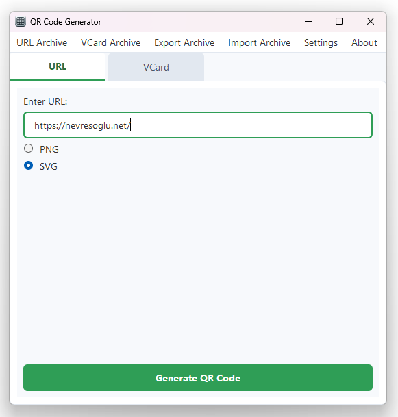
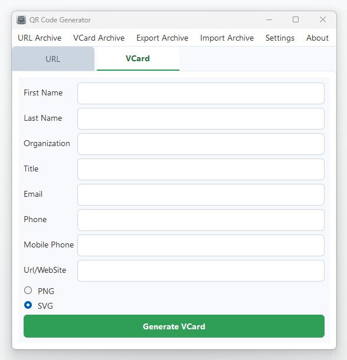
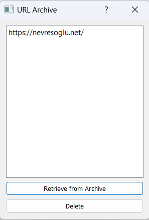
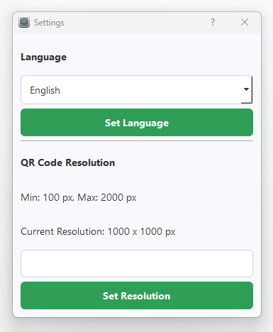

  

<h1 align="center">QR Code Generator</h1>

Hızlı, kolay ve ücretsiz QR kod oluşturucu.

  <a href="#-english">English</a> · <a href="#-türkçe">Türkçe</a>

---

## English

**QR Code Generator** is a free desktop application that allows you to quickly and easily create QR codes for your URLs or personal contact information (vCard) in PNG or SVG format.

This application is ideal for both personal and professional use. Thanks to its user-friendly interface, you can generate and save your QR codes in seconds without needing any technical knowledge.

### ✨ Features

* **QR Code from URL:** Create QR codes for websites, social media profiles, or any link.
* **VCard Support:** Generate QR codes for your digital business cards (vCard) containing your contact information such as name, surname, organization, phone, and email.
* **Two Different Formats:** Save your QR codes in pixel-based **PNG** or vector-based, high-quality **SVG** format.
* **Adjustable Resolution:** Set the resolution for the generated PNG files yourself (from 100px to 2000px).
* **Internal Archive:** Easily access, reuse, or delete your previously created URL and VCard records.
* **Multi-Language Support:** Turkish and English language options are available.
* **Automatic Update Check:** The program checks for a new version every time it starts and notifies you.

### 🖼️ Screenshots

| URL Tab | VCard Tab |
| :---: | :---: |
|  |  |
| **Archive Window** | **Settings Window** |
|  |  |
### 🚀 Download

You can safely download the latest version of the program from the link below. The setup file (`setup.exe`) allows you to easily install the program on your computer.

[**>> Download the Latest Version <<**](https://github.com/mnnevres/qr-code-generator/releases/latest)

## Feedback and Support

Your feedback, suggestions, or any bugs you encounter are very valuable to me. You can use one of the following methods to provide feedback:

* **For General Feedback and Suggestions:**
    You can contact me directly using the [contact form](https://nevresoglu.net/programs#contact) on my website.

* **For Bug Reports and Technical Requests (Recommended):**
    The most effective way to report a bug with details or to request a new feature is by using the "Issues" section on the project's GitHub page. This allows for a more organized tracking of reports.

    * **Bug Report for QR Code Generator:**
        [» QR Code Generator Issues Page](https://github.com/mnnevres/qr-code-generator/issues)

    * **Bug Report for MN Pdf Converter:**
        [» MN Pdf Converter Issues Page](https://github.com/mnnevres/mn-pdf-converter/issues)

---

## Türkçe

**QR Code Generator**, URL adresleriniz veya kişisel kartvizit bilgileriniz (VCard) için hızlı ve kolay bir şekilde PNG veya SVG formatında QR kodları oluşturmanızı sağlayan ücretsiz bir masaüstü uygulamasıdır.

Bu uygulama, hem kişisel hem de profesyonel kullanım için idealdir. Kullanıcı dostu arayüzü sayesinde, teknik bilgiye ihtiyaç duymadan saniyeler içinde QR kodlarınızı oluşturabilir ve kaydedebilirsiniz.

### ✨ Özellikler

* **URL'den QR Kod Oluşturma:** Web siteleri, sosyal medya profilleri veya herhangi bir bağlantı için QR kodları oluşturun.
* **VCard Desteği:** İsim, soyisim, organizasyon, telefon, e-posta gibi iletişim bilgilerinizi içeren dijital kartvizitler (VCard) için QR kodları oluşturun.
* **İki Farklı Format:** QR kodlarınızı piksel tabanlı **PNG** veya vektörel, kalitesi bozulmayan **SVG** formatında kaydedin.
* **Ayarlanabilir Çözünürlük:** Oluşturulacak PNG dosyaları için çözünürlüğü (100px - 2000px arası) kendiniz belirleyin.
* **Dahili Arşiv:** Daha önce oluşturduğunuz URL ve VCard kayıtlarınıza kolayca erişin, tekrar kullanın veya silin.
* **Çoklu Dil Desteği:** Türkçe ve İngilizce dil seçenekleri mevcuttur.
* **Otomatik Güncelleme Kontrolü:** Program her açıldığında yeni bir sürüm olup olmadığını kontrol eder ve sizi bilgilendirir.

### 🖼️ Ekran Görüntüleri

| URL Sekmesi | VCard Sekmesi |
| :---: | :---: |
|  |  |
| **Archive Window** | **Settings Window** |
|  |  |
### 🚀 İndirme

Programın en güncel sürümünü aşağıdaki bağlantıdan güvenle indirebilirsiniz. Kurulum dosyası (`setup.exe`), programı bilgisayarınıza kolayca kurmanızı sağlar.

[**>> En Son Sürümü İndir <<**](https://github.com/mnnevres/qr-code-generator/releases/latest)

### Geri Bildirim ve Destek

Programlarla ilgili görüşleriniz, önerileriniz veya karşılaştığınız hatalar benim için çok değerli. Geri bildirimde bulunmak için aşağıdaki yöntemlerden birini kullanabilirsiniz:

* **Genel Görüş ve Öneriler İçin:**
    Web sitemdeki [iletişim formunu](https://nevresoglu.net/programs#contact) kullanarak bana doğrudan ulaşabilirsiniz.

* **Hata Bildirimi ve Teknik Talepler İçin (Tavsiye Edilen):**
    Karşılaştığınız bir hatayı detaylarıyla bildirmek veya yeni bir özellik talep etmek için en etkili yöntem, projenin GitHub sayfasındaki "Issues" bölümünü kullanmaktır. Bu sayede bildirimler daha düzenli takip edilebilir.

    * **QR Code Generator için Hata Bildirimi:**
        [» QR Code Generator Issues Sayfası](https://github.com/mnnevres/qr-code-generator/issues)

    * **MN Pdf Converter için Hata Bildirimi:**
        [» MN Pdf Converter Issues Sayfası](https://github.com/mnnevres/mn-pdf-converter/issues)

---

## 👨‍💻 Geliştirici

**Mehmet Nevresoğlu**

* 🌐 Website: [nevresoglu.net](https://nevresoglu.net)
* 💼 LinkedIn: [linkedin.com/in/mehmet-nevresoglu-bb44341a/](https://www.linkedin.com/in/mehmet-nevresoglu-bb44341a/)

  

